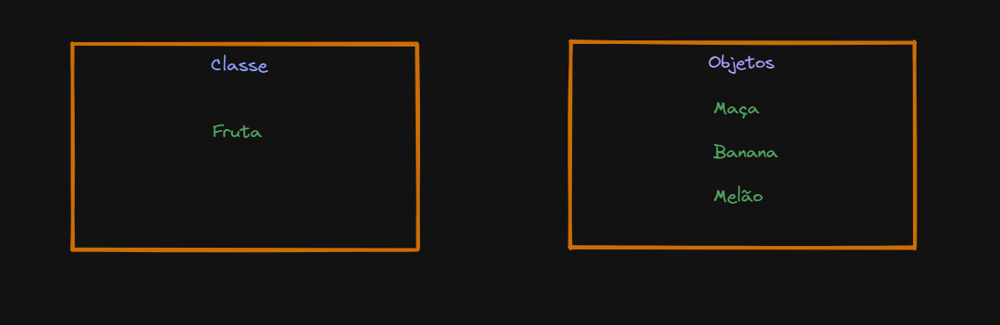

# Programação Orientada a Objetos(POO)

Na programação orientada a objetos nós trabalhamos com os principais conceitos:

* Classes
    * Uma classe é basicamente um template para objetos.

* Objetos
    * Já um objeto é uma instância(molde) da classe.



No exemplo acima temos a classe chamada Fruta e ao lado temos os objetos sendo: Maça, Banana e Melão.

Quando um objeto é criado ele herda todos as variáveis e métodos(funções) da classe.

Além disso podemos dizer que uma classe é uma espécie de objeto construtor para a criação de objetos.

## Criando uma classe em Java

```java
public class Main {
    int x = 5;
}
```

No exemplo acima temos uma classe chamada Main(classes são declaras com a primeira letra maiúscula.) e essa classe possui uma variável x do tipo int. Além disso, o nome do arquivo deve ser igual ao nome da classe na linguagem Java.


## Criando um Objeto

Em java, um objeto é criado a partir de uma classe. No exemplo acima criamos a classe Main, iremos fazer uso dessa classe para criar um objeto, vejamos:

```java
public class Main {
    int x = 5;

    public static void main(String[] args) {

        Main myObject = new Main();
        System.out.println(myObject.x);
    }
}
```

Nota: Fazemos uso da palavra-chave new para criar objetos de uma classe.

No exemplo acima criamos um objeto chamado myObject, esse objeto é uma instância(molde) da classe Main, em seguida fazemos uso desse nosso objeto myObject para acessar e exibir o valor da variável x, que nesse caso é 5.

Em resumo, esse nosso objeto(myObject) herda todas as variáveis e métodos da classe Main.

## Criando múltiplos objetos de uma única classe

É possivel criar vários objetos diferentes de uma mesma classe, vamos fazer uso do exemplo acima:

```java
public class Main {
    int x = 5;

    public static void main(String[] args) {

        Main myObject1 = new Main();
        Main myObject2 = new Main();
        System.out.println(myObject1.x);
        System.out.println(myObject2.x);
    }
}
```

Note que criamos dois objetos, um chamado myObject1 e o outro chamado myObject2, ambos são instâncias da classe Main, portanto ambos tem acesso a variável x da classe Main.

## Atributos de Classes

Anteriormente falamos sobre a variável x que faz parte da classe Main

```java
public class Main {
    // Atributo da classe Main
    int x = 5;
}
```

Essa variável é basicamente chamada de Atributo da classe Main, em resumo atributos são variáveis que pertecem a classe.


## Acessando os atributos da classe com o operador dot(.)

É possivel acessar os atributos da classe ao criarmos um objeto da classe e em seguida utilizar o operador dot(.) para acessar os valores.

```java
public class Main {
    int x = 5;

    public static void main(String[] args) {

        Main myObject = new Main();
        System.out.println(myObject.x);
    }
}
```

No exemplo acima criamos um objeto chamado myObject que acessa o atributo x da classe Main, note que fazemos uso do operador dot(myObject.x).

Além disso é possivel modificar o valor dos atributos:

```java
public class Main {
    int x;

    public static void main(String[] args) {

        Main myObject = new Main();
        myObject.x = 100;
        // Imprime 100 na tela.
        System.out.println(myObject.x);
    }
}
```

Note que atribuimos o valor 100 para o nosso atributo x. É possivel sobrescrever os valores dos atributos.

Podemos ter quantos atributos quisermos em uma classe.

```java
public class Main {
    String firstName = "Douglas";
    String lastName = "Jesus";
    int age = 22;

    public static void main(String[] args) {

        Main myObject = new Main();
        System.out.println("Name: " + myObject.firstName + " " + myObject.lastName);
        System.out.println("Age: " + myObject.age);
    }
}
```

Note que temos 3 atributos, sendo duas strings e um inteiro e em seguida, criamos o objeto myObject que é uma instância da classe Main e acessamos os atributos através do nosso objeto.

## Métodos de classes

Metodos são declarados dentro de uma classes e são utilizados para realizar certas tarefas.

```java
public class Main {
    static void myMethod() {
        System.out.println("Hello, world!");
    }

    public static void main(String[] args) {
        // Imprime Hello, world! na tela.
        myMethod();
    }
}
```

No exemplo acima criamos um método chamado myMethod() que está dentro da classe Main. Ao realizarmos a chamada do método ele basicamente irá imprime Hello, world! na tela. 

## Static vs Non-Static

No exemplo acima fizemos uso da palavra-reservada static no método myMethod(), ela basicamente permite que acessemos o método sem precisar criar um objeto da classe, o que é diferente da palavra-chave public que necessita de um objeto.

```java
public class Main {
  // Static method
  static void myStaticMethod() {
    System.out.println("Static methods can be called without creating objects");
  }

  // Public method
  public void myPublicMethod() {
    System.out.println("Public methods must be called by creating objects");
  }

  // Main method
  public static void main(String[] args) {
    myStaticMethod(); // Call the static method
    // myPublicMethod(); This would compile an error

    Main myObj = new Main(); // Create an object of Main
    myObj.myPublicMethod(); // Call the public method on the object
  }
}
```

Note que no exemplo acima, para acessarmos o método myPublicMethod() foi necessário criar um objeto(instância/molde) da classe Main(contém o método myPublicMethod()) para poder acessar o método. Essa é a grande diferença entre as palavras-chaves public e static.


## Método de acesso com um objeto

```java
public class Main {
    public void fullThrottle() {
        System.out.println("O carro está indo o mais rápido possível!")
    }

    public void speed(int maxSpeed) {
        System.out.prinln("A velocidade máxima é: " + maxSpeed);
    }

    public static void main(String[] args) {
        // Criamos um objeto chamado myCar para acessar os métodos da classe Main.
        Main myCar = new Main();
        // Acessando os métodos e passando argumentos.
        myCar.fullThrottle();
        myCar.maxSpeed(200);
    }
}
```

O código acima basicamente possui dois métodos dentro da classe Main, fazemos acesso aos métodos através da criação de um objeto(myCar) e acessamos os seus métodos/atributos utilizando a notação dot(.). O resultado é basicamente esse:

```
O carro está indo o mais rápido possível!
A velocidade máxima é: 200
```

## Constructors(Construtores)

Um construtor em java é basicamente um método especial que é utilizado para inicializar objetos. O construtor é chamado quando o objeto da classe é criado. Além disso, ele pode ser usado para definir valores iniciais para atributos de objetos.

```java
public class Main {
    // Criamos um atributo da classe Main.
    int x;

    // Criamos um construtor de classe para a classe Main.
    public Main() {
        // Definimos o valor inicial para o atributo da classe Main.
        x = 5;
    }

    public static void main(String[] args) {
        // Criamos um objeto da classe Main, isso resultará na chamada do construtor.
        Main myObject = new Main();
        // Exibe 5 na tela.
        System.out.println(myObject.x);
    }
}

```

Ou seja, no exemplo acima o construtor irá inicializar o atributo x da classe Main, que terá valor 5. O construtor é sempre chamado quando criamos um objeto.

NOTA: O nome do construtor deve ser igual ao nome da Classe, nesse caso ambos são Main. Além disso, o construtor não pode ter um tipo de retorno de tipo, ex: void.

## Utilizando parâmetros nos construtores

Os construtores podem conter parâmetros, que nesse caso são utilizados para inicializar atributos.

```java
public class Main {
    int x;

    public Main(int y) {
        x = y;
    }

    public static void main(String[] args) {
        // Passamos 5 como argumento para o construtor.
        Main myObject = new Main(5);
        // Exibe 5 na tela.
        System.out.println(myObject.x);
    }
}

```

Podemos ter quantos parâmetros quisermos, vejamos:

```java
public class Main {
    // Atributos
    int modelYear;
    String modelName;

    // Construtor
    public Main(int year, String name) {
        // Inicializamos nossos atributos com os parâmetros do construtor Main.
        modelYear = year;
        modelName = name;
    }

    public static void main(String[] args) {
        // Criamos um objeto e logo em seguida, chamamos o nosso construtor e passamos dois argumentos.
        Main myCar = new Main(1969, 'Mustang');
        // Imprime 1969 Mustang na tela.
        System.out.println(myCar.modelYear + " " + myCar.modelName);
    }
}

```

## Modifiers(Modificadores)

No exemplo acima fazemos uso da palavra-chave public, public é basicamente um modificador de acesso e é utilizado para definir o "nivel" de acesso a classes, atributos, métodos e construtores.

Definimos modificadores em dois grupos:

* Modificador de acesso:
    * Controla o nível de acesso.

* Modificadores de não acesso:
    * Não controla o nível de acesso, mas fornece outras funcionalidades.

# Modificadores de Acesso

## Para classes nós podemos utilizar o public ou o default.

* public:
    * A classe se torna acessivel por outras classes.

* default:
    * A classe só é acessivel por classes que estejam no mesmo package(pacote). Essa forma é utilizada quando nós não especificamos um modificador. Veremos mais sobre packages mais adiante.

## Para atributos, métodos e construtores podemos utilizar public, private, default e protected.

* public:
    * O código é acessivel por todas as classes.

* private:
    O código só é acessivel dentro da classe declarada.

* default:
    * A classe só é acessivel por classes que estejam no mesmo package(pacote).

* protected:
    * O código é acessivel no mesmo package(pacote) e nas subclasses. Veremos mais sobre subclasses mais adiante.


# Modificadores de não acesso

## Para classes podemos utilizar tanto o final como o abstract

* final:
    * A classe não pode ser herdada por outra classe. Veremos mais sobre inheritance(herança) mais adiante.

* abstract:
    * A classe não pode ser utilizada para criar objetos. Para acessar uma classe abstrata ela deve ser herdada por outra classe. Veremos mais sobre inheritance e abstraction mais adiante.

## Para atributos e métodos podemos utilizar final, static e abstract

* final:
    * Os atributos e métodos não podem ser modificados.

* static:
    * Os atributos e métodos pertencem a classe, e não a objetos.

* abstract:
    * Só podem ser utilizados em classes abstratas e só podem ser utilizados em métodos. O método em sí não possui um "corpo", por exemplo: abstract void run(); O corpo é fornecido por subclasses que são herdadas.


O programa abaixo faz uso da palavra-chave final, dessa forma nossos atributos não podem ser modificados.

```java
public class Main {
    final int x = 10;
    final double PI = 3.14;

    public static void main(String[] args) {
        Main myObject = new Main();

        // Error, não é possivel alterar/modificar o valor do atributo.
        myObject.x = 50;
        // Error, não é possivel alterar/modificar o valor do atributo.
        myObject.PI = 25;

        System.out.println(myObject.x);
    }
}
```

O programa abaixo faz uso da palavra-chave static, isso significa que podemos acessar os métodos da classe sem precisar criar um objeto da classe.

```java
public class Main {
    static void myStaticMethod() {
        System.out.println("Métodos estáticos podem ser acessados/chamados sem precisar criar um objeto.");
    }

    public void myPublicMethod() {
        System.out.println("Métodos públicos só podem ser acessados/chamados quando criamos um objeto da classe.");
    }

    public static void main(String[] args) {
        // Método estático
        myStaticMethod();

        // Método público
        Main myObject = new Main();
        myObject.myPublicMethod();
    }
}
```

Exemplo com a palavra-chave abstract. Um método abstrato pertence a uma classe abstrata, logo ela não possui um "corpo". O corpo é fornecido por uma subclasse.

```java
// Arquivo Main.java

// Classe abstrata Main
abstract class Main {
    public String first_name = "Douglas";
    public int age = 22;
    // Método abstrato
    public abstract void study();
}

    // Subclasse herdada da classe Main
    class Student extends Main {
        public int graduationYear = 2026;
        // O "corpo" do método abstrato é fornecido aqui.
        public void study() {
            System.out.println("Estudando o dia todo!");
        }
}

    // Arquivo Second.java

    // Criamos uma segunda classe em um novo arquivo chamado Second.java, coloquei tudo junto aqui por questão de espaço mesmo.
    class Second {
    public static void main(String[] args) {
        // Criamos um objeto da classe Student, onde herda todos os atributos/métodos da classe Main.
        Student myObject = new Student();

        // Acessamos os atributos e métodos da classe Student e Main.
        System.out.println("Nome: " + myObject.first_name);
        System.out.println("Idade: " + myObject.age);
        System.out.println("Ano de graduação: " + myObject.graduationYear);
        myObject.study();
    }
}
```

Ao executar o arquivo Second.java temos:

```
Nome: Douglas
Idade: 22
Ano de graduação: 2026
Estudando o dia todo!
```

Note que no arquivo Main.java Temos duas classes separadas, é muito importante prestar atenção nas chaves. Na classe Main temos uma classe abstrata e um método abstrato study(); note que o "corpo" dele não possui nada, definimos o corpo dele na classe Student, onde imprimimos "Estudando o dia todo!". 

Já no arquivo Second.java criamos um objeto chamado myObject que herda todos os métodos/atributos da classe Student e Main, logo em seguida utilizamos esse nosso objeto(myObject) para exibir os resultados.


# Encapsulation(Encapsulamento)

Basicamente o significado de "Encapsulamento" é: Esconder dados sensíveis do usuário. Para fazer uso do encapsulamento nós devemos:

* Declarar atributos de uma classe como sendo private(privado)

* Fornecer métodos públicos(public) get() e set() para acessar e modificaros valores dos atributos privados.


Como vimos anteriormente, atributos/variáveis privadas(private) só podem ser acessadas dentro da classe pertencente. No entanto, podemos fazer uso dos métodos set() e get() para acessar/modificar esses atributos.

* O método get() retorna o valor da variável/atributo.

* O método set() define o valor da variável/atributo.

Vejamos:

```java
public class Person {
    // Declaramos a variável/atributo name como sendo privado.
    private String name;

    // Getter Method
    public String getName() {
        return name;
    }

    // Setter Method
    // Como não retornamos nada, fazemos uso do void.
    public void setName(String newName) {
        this.name = newName;
    }
}
```

No exemplo acima temos que o método getName() retorna o valor da variável/atributo name.

Já o método setName() recebe como argumento uma String, nesse caso vai receber o valor da variável/atributo name. Fazemos uso da palavra-chave this que é usada para referir a um objeto.

Como a variável name é privada(private), nós não podemos criar um objeto e simplesmente usar o a variável/atributo name, por exemplo:


```java
public class Main {
    public static void main(String[] args) {
        Person myObject = new Person();

        // Error
        myObject.name = "Douglas";
        // Error
        System.out.println("myObject.name")";
    }
}
```

No exemplo acima estamos tentando acessar uma variável/atributo private, isso irá gerar um erro. Para acessar e definir um valor, fazemos uso dos métodos set() e get(), vejamos:

```java
public class Main {
    public static void main(String[] args) {
        // Criamos um objeto(instância) da classe Person
        Person myObject = new Person();
        // Utilizamos o método setName() e passamos "Douglas" como argumento, dessa forma definimos o atributo/variável name como sendo Douglas.
        myObject.setName("Douglas");
        // Utilizando o método getName() para acessar o valor da variável/atributo name.
        System.out.println(myObject.getName());
    }
}
```

O resultado será: Douglas

Primeiro definimos name como sendo "Douglas" através do método setName(newName); e em seguida, acessamos o valor de name através do método getName().


# Java Packages(pacotes) & API

Um pacote(package) em java é utilizado para agrupar classes relacionadas. Podemos pensar em um pacote como sendo uma pasta em um determinado diretório de arquivo. Fazemos uso de pacotes para evitar conflitos com nomes e para escrever e manter bons códigos. Nós dividimos pacotes em duas categorias:

* Built-in Packages(São pacotes derivados da API Java), ou seja, pacotes já feitos.

* User-defined- Packages(Nós criamos nossos próprios pacotes).


## Built-in Packages

Java API é uma biblioteca de classes já pré-escritas, que são gratuitas para se utilizar.

A biblioteca é dividida entre packages e classes, isso quer dizer que nós podemos importar uma única classe(que contém todos os seus métodos e atributos) ou podemos importar todo um pacote(package) que contém todas as classes pertencentes a esse pacote.

Para importar classes/packages fazemos uso da palavra reservada import, ex:

```java
// Importa uma única classe
import package.name.Class;

// Importa todo o pacote(package)
import package.name.*;
```

Um exemplo básico seria a classe Scanner, podemos importar ela da seguinte forma:

```java
// Nos permite utilizar métodos para receber os inputs.
import java.util.Scanner;
```

No exemplo acima, java.util é um package(pacote) enquanto que Scanner é uma classe que faz parte do pacote(package) java.util.


Para utilizar a classe Scanner nós devemos criar um objeto da classe Scanner e em seguida podemos utilizar os mais diversos métodos que a classe Scanner nos fornece, ex:

```java
import java.util.Scanner;

public class ScannerClass {
    public static void main(String[] args) {
        // Criamos um objeto input da classe Scanner
        Scanner input = new Scanner(System.in);
        System.out.print("Digite o seu nome: ");

        String name = input.nextLine();
        System.out.println("Hello, " + name + "!");
    }
}
```

Note que criamos o objeto input da classe Scanner e em seguida, fazemos uso do método nextLine() que lê uma linha completa de dados.

O resultado:

```
Hello, Douglas!
```

## Importando um pacote

Para importar um pacote completo(contendo todas as classes, métodos e atributos) fazemos uso do asterístico no final, ex:

```java
import java.util.*;
```

# User-defined Package

Para criar nossos própios pacotes, devemos entender que java faz uso do sistema de diretórios para armazenar nossos dados. Para criar um pacote(package) basta utilizar a palavra reservada package nome_do_pacote;

```java
package OOP_Tutorial;

class MyPackageClass {
    public static void main(String[] args) {
        System.out.println("Esse é o meu pacote!");
    }
}
```

O exemplo acima OOP_Tutorial é o nome da pasta onde estamos armazenando o nosso pacote.